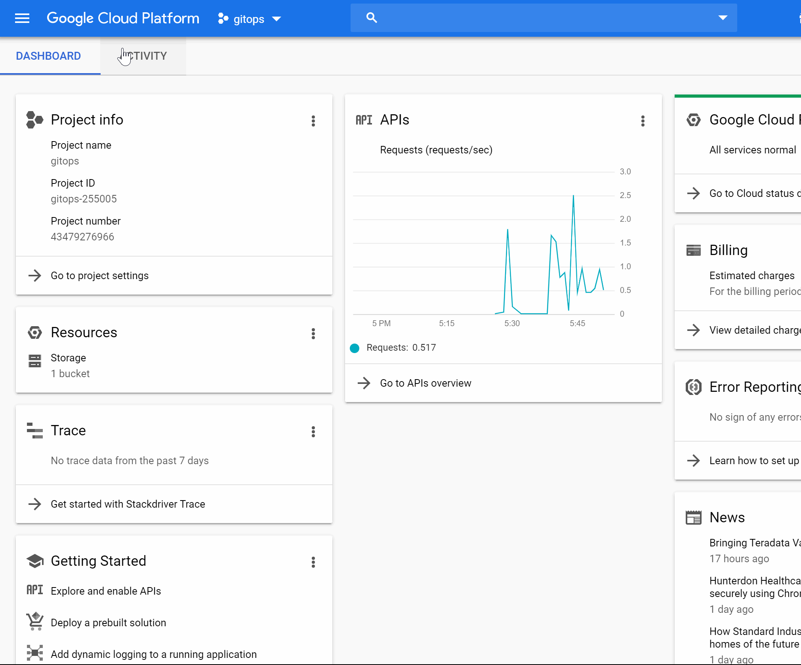

## Getting Started with GitOps on Google Cloud

This page explains how to set up pull-based GitOps on Google Cloud Platform using Weavework's [flux](https://github.com/fluxcd/flux).
All code used on this page can be found in full on [GitHub](https://github.com/gitops-tech).

### Setting Up the Google Cloud Project

Either select an existing project or [create a new one](https://console.cloud.google.com/cloud-resource-manager) in the Google Cloud Console.

For this project, the Google Kubernetes Engine and Google Cloud Build APIs need to be enabled.


### Building Container Images with Google Cloud Build

Google Cloud Build uses the `cloudbuild.yaml` file in the root of the repository to find the steps to execute the build.
For this project, first the Go binaries need to be build.
Then, the container image is build, tagged and pushed to the Google Container Registry.
The following `cloudbuild.yaml` file can also be found on [GitHub](https://github.com/gitops-tech).

```yaml
steps:
# build the binaries
- name: 'gcr.io/cloud-builders/go'
  args: ['build', '-o', 'hello', 'src/main.go']

# build the container image, tag it and push it to the Google Container Registry of our project
- name: 'gcr.io/cloud-builders/docker'
  args: ['build', 
      '-t', 'gcr.io/$PROJECT_ID/$REPO_NAME:$BRANCH_NAME-$SHORT_SHA',
      '-t', 'gcr.io/$PROJECT_ID/$REPO_NAME:latest',
      '-f', 'Dockerfile', '.']

images:
- 'gcr.io/$PROJECT_ID/$REPO_NAME:$BRANCH_NAME-$SHORT_SHA'
- 'gcr.io/$PROJECT_ID/$REPO_NAME:latest'
```

Next, a trigger for Google Cloud Build needs to be created, to execute the build when new commits are pushed to the repository.


### Setting up the Kubernetes Cluster

Next, create a Kubernetes cluster in Google Kubernetes Engine.
If you are setting up GitOps for an existing project you can skip this step.



Of course, you can also use Infrastructure as Code tools such as Terraform to set up your cluster.

### Adding the Kubernetes Manifests to the Environment Repository

To tell the operator what to actually deploy on the cluster, you have to initially write the Kubernetes manifests.

```yaml
# deployment.yaml
apiVersion: extensions/v1beta1
kind: Deployment
metadata:
  name: example-application
spec:
  replicas: 3
  template:
    metadata:
      labels:
        app: example-application
    spec:
      containers:
      - name: example-application
        image: gcr.io/gitops-255005/example-application:master-f7517f2
        ports:
        - containerPort: 8080
---

# service.yaml
apiVersion: v1
kind: Service
metadata:
  name: example-application
  labels:
    app: example-application
spec:
  type: LoadBalancer
  ports:
  - port: 8080
  selector:
    app: example-application
```

Create these files in your environment repository, commit and push.
However, you do not have to deploy it to your newly created cluster.
The operator will deploy it in the next step.


### Deploying the Operator

Finally, the last thing to do is deploy the Flux operator.
Clone the [Flux Git Repository](https://github.com/fluxcd/flux) and copy the `/deploy` directory to the environment repository.

```bash
git clone git@github.com:fluxcd/flux.git
```

Flux needs to know where the environment repository is located.
Change the URL to your environment repository in `flux-deployment.yaml` to your Git URL.
Now, Flux can be deployed to the cluster.

```bash
kubectl apply -f .
```

This will deploy an instance of flux observing the master branch of your repository in its own Kubernetes namespace.

If your repository is not publicly accessible, allow access to the repository for Flux's SSH key.
The key can be accessed with the command line utility [fluxctl](https://docs.fluxcd.io/en/stable/references/fluxctl.html).

```bash
fluxctl identity --k8s-fwd-ns flux
```

Confirm that flux deployed your application by running 

```console
$ fluxctl list-workloads --k8s-fwd-ns flux
WORKLOAD           CONTAINER  IMAGE                RELEASE   POLICY
default:[...]/app  app        gcr.io/[...]/app:v1  ready     automated
```